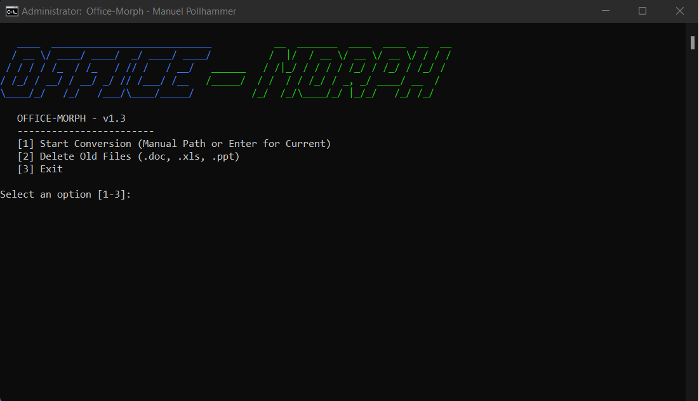
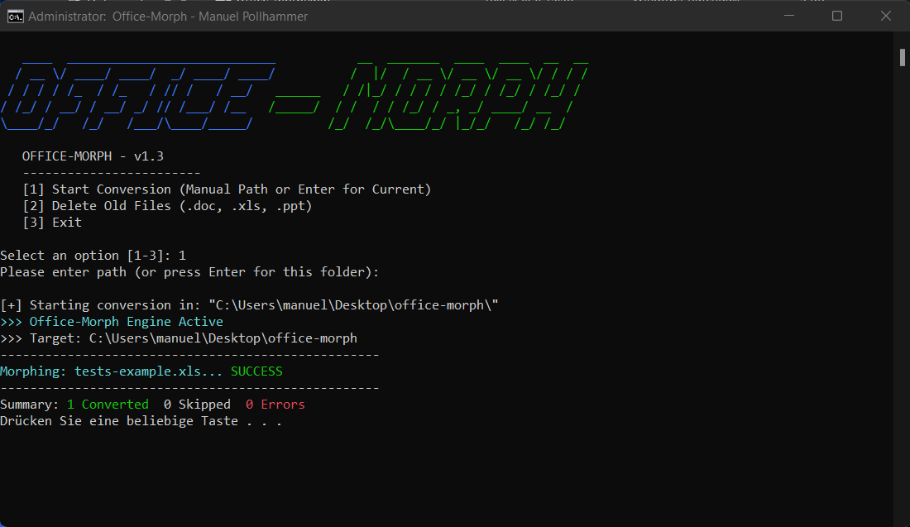
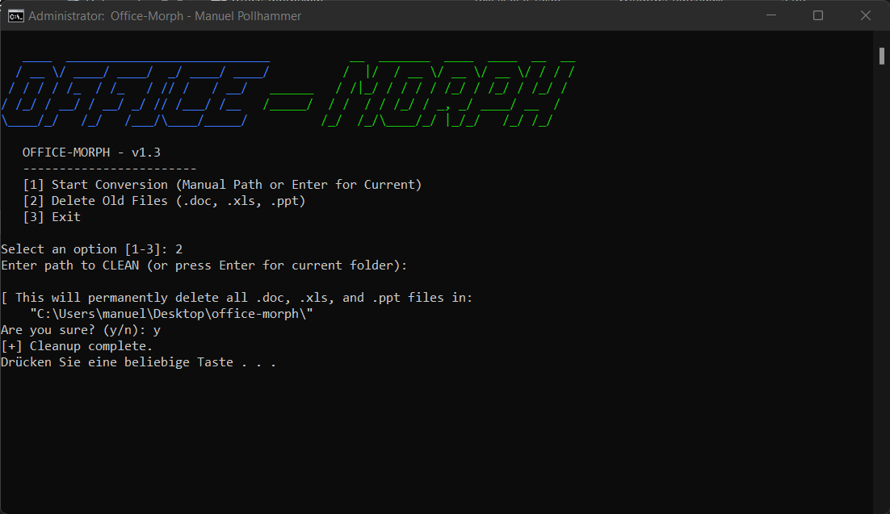
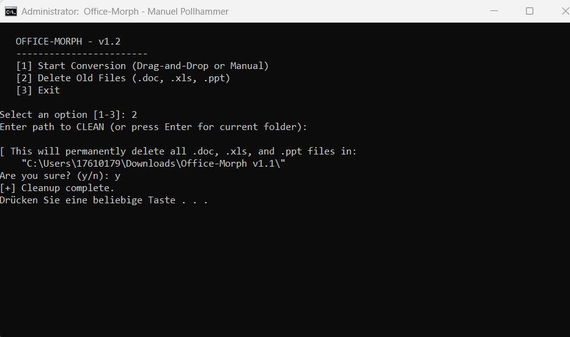

  

 # Office-Morph  v1.3
 **.doc, .xls, .ppt ➔ .docx, .xlsx, .pptx** 
  by Manuel Pollhammer (2026)

---

## 🚀 What is Office-Morph?
**Office-Morph** is an intelligent automation utility designed to seamlessly convert legacy Microsoft Office binary formats into modern XML standards. It streamlines the transition from older archives to current, accessible formats.

## 📦 Components
*   **Offic-Morph.bat**: The interactive main menu and execution interface.
*   **FolderConverter.ps1**: The high-performance core processing engine.

## 📝 Usage Modes
The tool is highly flexible and offers three distinct execution modes:

1.  **Drag'n'Drop (Maximum Convenience):** 
    Simply drag a folder and drop it directly onto the `Office-Morph.bat` file.
2.  **Manual Input:** 
    Launch the batch file and paste the target directory path into the console, then confirm with **Enter**.
3. **Express Mode (Current Folder):**
   Press **Enter** to process the tool's current directory.

---

## 🛠️ New in v1.3: Maintenance Module
After converting your files, you can now use **Option [2]** in the main menu to:
*   **Deep Clean:** Recursively scan and permanently delete old `.doc`, `.xls`, and `.ppt` files.
*   **Safety First:** Includes a confirmation prompt to prevent accidental data loss.
*   **New Logo:** Freshly designed ASCII art Logo

---

## ⚠️ Important: Administrative Rights
This tool requires **LOCAL ADMINISTRATOR PRIVILEGES** to access Office COM interfaces and perform file system operations.  
**Please run `Offic-Morph.bat` by RIGHT-CLICKING and selecting "RUN AS ADMINISTRATOR".**

---

## ✨ Key Features
*   **Summary Statistics:** Provides a detailed report (Converted / Skipped / Errors) after each run. **✨NEW✨**
*   **Deep Scan:** Automatically detects legacy files across all subdirectories. **✨NEW✨**
*   **Smart Skip:** Efficiently skips files already converted to save time.
*   **Temp-File Shield:** Automatically ignores hidden Office temporary files (`~$`). **✨NEW✨**
*   **Clean Naming:** Advanced logic prevents double file extensions (e.g., no `..xlsx`).

## 📋 Prerequisites
*   Installed Microsoft Office Suite (Word, Excel, PowerPoint).
*   Windows PowerShell 5.1 or higher.
*   Local Administrator permissions.

---

## 📸 Screenshots

  
   
  <i>Main Menu</i>

  
   
  <i>Interface and Execution</i>

  
   
  <i>Delete old (.doc, .xls, .ppt) files</i>

  
   
  <i>Successful Conversion Process</i>

---
**Developed by Manuel Pollhammer | Release 2026**

