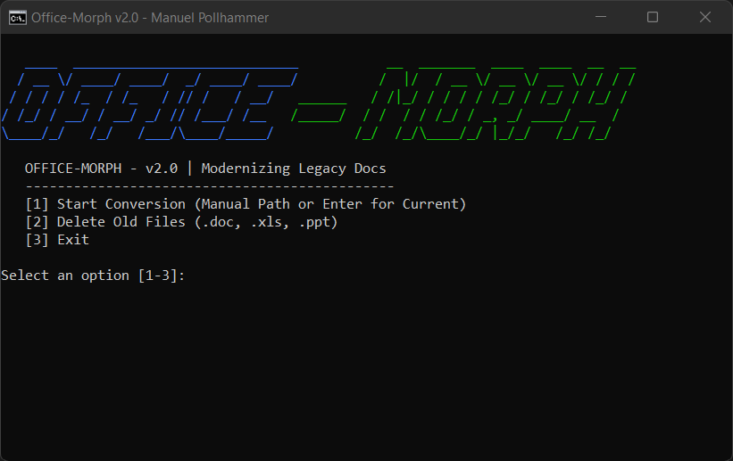
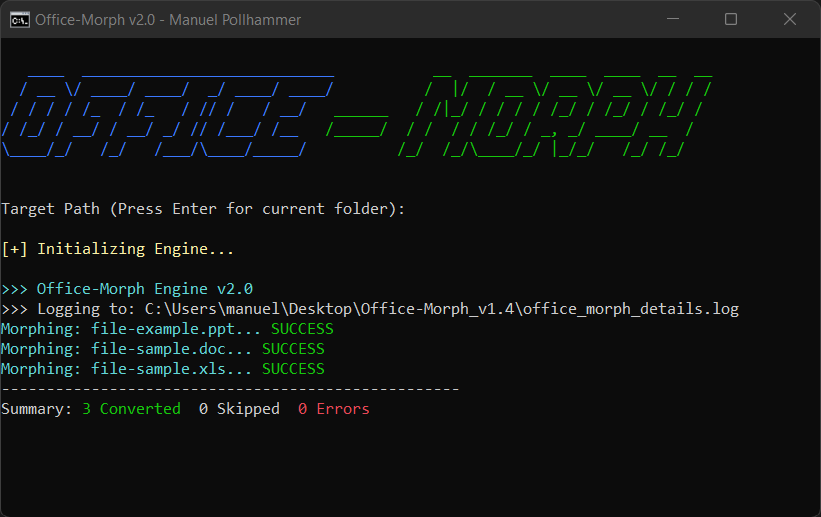
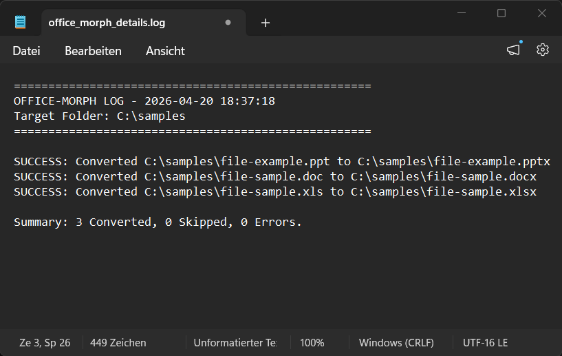

  

 # Office-Morph  v2.0
 **.doc, .xls, .ppt ➔ .docx, .xlsx, .pptx** 
  by Manuel Pollhammer (2026)

---

## 🚀 What is Office-Morph?
**Office-Morph** is an intelligent automation utility designed to seamlessly convert legacy Microsoft Office binary formats into modern XML standards. It streamlines the transition from older archives to current, accessible formats using the native Office COM engine.

  
   
  <i>How It Works: Automated batch processing in action.</i>

## 📦 Components
*   **Office-Morph.bat**: The interactive main menu with a new fixed-scale UI (91x24).
*   **FolderConverter.ps1**: The high-performance core processing engine with advanced logging.

## 📝 Usage Modes
The tool is highly flexible and offers three distinct execution modes:

1.  **Manual Input:** 
    Launch the batch file and paste the target directory path into the console.
2.  **Express Mode (Current Folder):**
    Press **Enter** without a path to process the tool's current directory.
3.  **Secure Cleanup:**
    Integrated mode to permanently delete legacy files after verification.

---

## 🛠️ New in v2.0: Professional Stability & UI
The 2.0 update marks a major leap in reliability and user experience:

* **Fixed Window Scaling:** Optimized 91x24 console layout for consistent UI presentation.
* **Refined PowerShell Core:** Faster indexing and improved COM object disposal to prevent ghost processes.
* **Enhanced Delete Logic:** Now uses a native PowerShell command for safer recursive file removal.
* **Smart Error Analysis:** Enhanced detection for **Path Too Long** issues (>260 chars) on network drives.

---

## ✨ Key Features
*   **Detailed Reports:** Full breakdown (Converted/Skipped/Errors) displayed in console and saved to `office_morph_details.log`.
*   **Deep Scan:** Automatically detects and converts legacy files across all subdirectories.
*   **Smart Skip:** Detects existing `.docx/.xlsx/.pptx` files to avoid redundant processing.
*   **Temp-File Shield:** Automatically ignores hidden Office owner files (`~$`).
*   **ANSI Color Support:** Clear visual feedback for successes, skips, and errors.

---

## 📋 Prerequisites
*   Installed Microsoft Office Suite (Word, Excel, PowerPoint).
*   Windows PowerShell 5.1 or higher.
*   **Execution Policy:** The `.bat` launcher automatically handles the `Bypass` policy for the session.

---

## 📸 Screenshots

  
   
  <i>Main Menu with v2.0 ASCII Header</i>

 
   
 <i>Processing Engine in Action</i>

 
   
  <i>Detailed Log File Output</i>

---
**Developed by Manuel Pollhammer | Release 2026**
