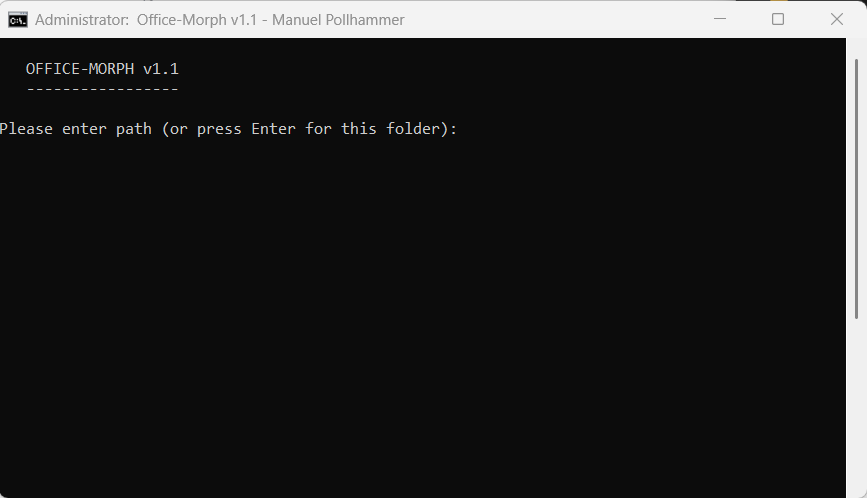
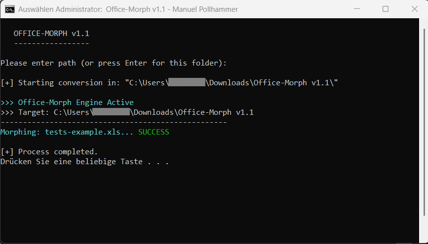
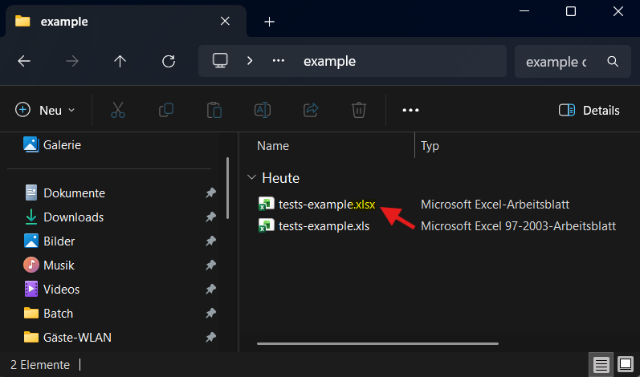

# OFFICE-MORPH 2026 - Version 1.1
**Powered by PowerShell | © 2026 Manuel Pollhammer**

---

## 📝 Description
**Office-Morph 2026** is an intelligent automation utility designed to seamlessly convert legacy Microsoft Office binary formats into modern XML standards.

## 📦 Components
*   **Office_Morph_2026.bat**: The primary execution interface (Starter).
*   **FolderConverter.ps1**: The core processing engine.

## 🚀 Usage Modes
The tool is highly flexible and offers three distinct execution modes:

1.  **Drag-and-Drop (Maximum Convenience):** 
    Simply drag a folder and drop it directly onto the `Office-Morph.bat` file.
2.  **Manual Input:** 
    Launch the batch file and paste the target directory path into the console, then confirm with **Enter**.
3.  **Express Mode (Current Folder):** 
    Launch the batch file and press **Enter** at the path prompt to process the directory where the tool is located.

---

## ⚠️ Important: Administrative Rights
This tool requires **LOCAL ADMINISTRATOR PRIVILEGES** to access Office COM interfaces and perform file system operations.  
**Please run `Office-Morph.bat` by RIGHT-CLICKING and selecting "RUN AS ADMINISTRATOR".**

---

## ✨ Key Features
*   **Deep Scan:** Automatically detects `.doc`, `.xls`, and `.ppt` files across all subdirectories.
*   **Smart Skip:** Efficiently skips files that have already been converted to modern formats.
*   **Clean Naming:** Advanced logic prevents double file extensions (e.g., no `..xlsx`).
*   **Multi-App Sync:** Orchestrates Word, Excel, and PowerPoint instances in parallel for maximum efficiency.

## 🛠 Prerequisites
*   Installed Microsoft Office Suite (Word, Excel, PowerPoint).
*   Windows PowerShell 5.1 or higher.
*   Built in 2026 for maximum compatibility.

---

## 📸 Screenshots

  
   
  <i>Interface and Execution</i>

  
   
  <i>Interface and Execution</i>

  
   
  <i>Successful Conversion Process</i>

