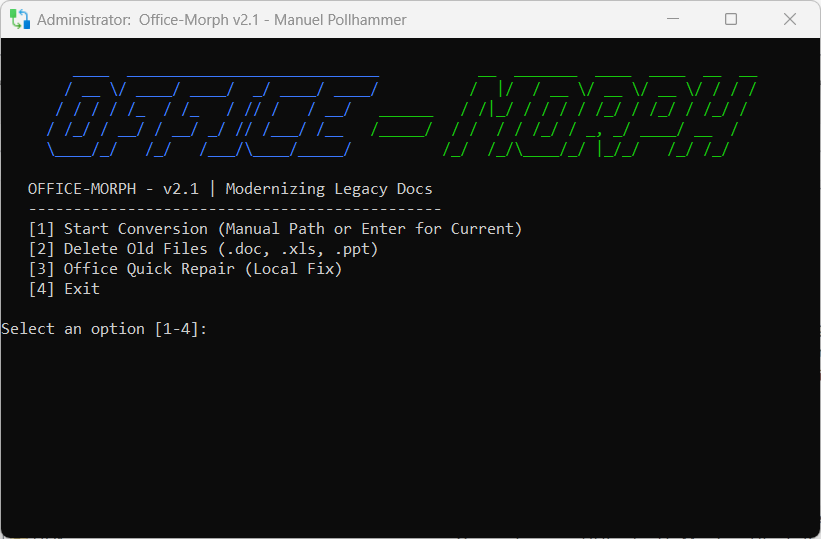
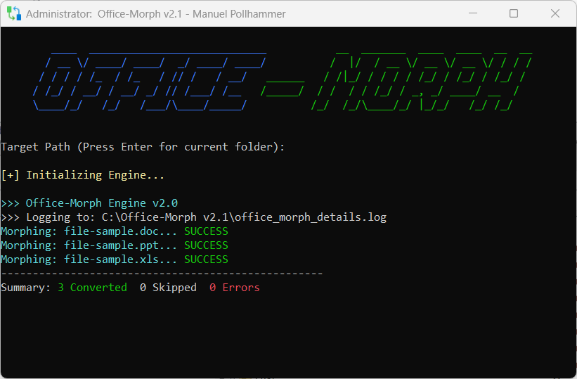
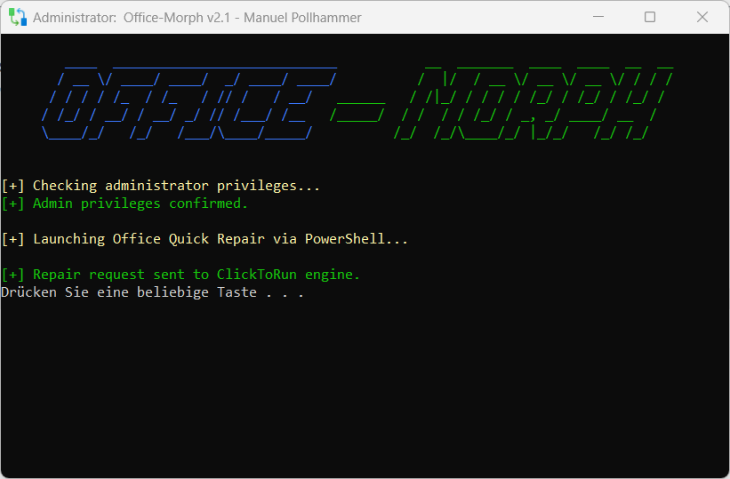
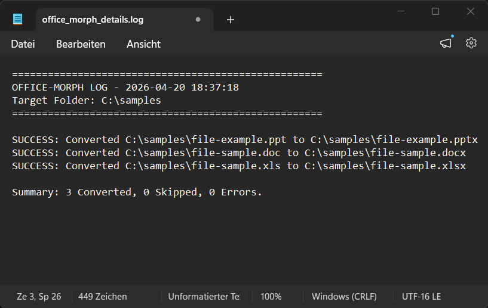

  

# Office-Morph  v2.1
**.doc, .xls, .ppt ➔ .docx, .xlsx, .pptx** 
by Manuel Pollhammer (2026)

---

## 🚀 What is Office-Morph?
**Office-Morph** is an intelligent automation utility designed to seamlessly convert legacy Microsoft Office binary formats into modern XML standards. It streamlines the transition from older archives to current, accessible formats using the native Office COM engine.

  
   
  <i>How It Works: Automated batch processing in action.</i>

## 📦 Components
*   **Office-Morph.bat**: The interactive main menu with a fixed-scale UI (91x25).
*   **FolderConverter.ps1**: The high-performance core processing engine with advanced logging.

## 📝 Usage Modes
The tool is highly flexible and offers four distinct execution modes:

1.  **Manual Input:** 
    Launch the batch file and paste the target directory path into the console.
2.  **Express Mode (Current Folder):**
    Press **Enter** without a path to process the tool's current directory.
3.  **Secure Cleanup:**
    Integrated mode to permanently delete legacy files after verification.
4.  **Office Quick Repair:**
    Built-in troubleshooting option to launch a local Microsoft Office repair directly via the command line.

---

## 🛠️ New in v2.1: Office Maintenance Integration
The 2.1 update introduces built-in maintenance tools alongside the core conversion features:

* **Integrated Quick Repair:** Instantly trigger a local Microsoft Office repair process without navigating through the Windows Control Panel.
* **Privilege Detection:** Smart checking for administrative rights to ensure the repair engine runs successfully.
* **Fixed Window Scaling:** Minor adjustment to a 91x25 console layout to perfectly accommodate the expanded menu.

---

## ✨ Key Features
*   **Detailed Reports:** Full breakdown (Converted/Skipped/Errors) displayed in console and saved to `office_morph_details.log`.
*   **Deep Scan:** Automatically detects and converts legacy files across all subdirectories.
*   **Smart Skip:** Detects existing `.docx/.xlsx/.pptx` files to avoid redundant processing.
*   **Temp-File Shield:** Automatically ignores hidden Office owner files (`~$`).
*   **ANSI Color Support:** Clear visual feedback for successes, skips, and errors.
*   **One-Click Maintenance:** Fast troubleshooting for corrupted Office COM engines directly from the menu.

---

## 📋 Prerequisites
*   Installed Microsoft Office Suite (Word, Excel, PowerPoint).
*   Windows PowerShell 5.1 or higher.
*   **Execution Policy:** The `.bat` launcher automatically handles the `Bypass` policy for the session.
*   **Administrative Privileges:** Required only when using the Office Quick Repair option.

---

## 📸 Screenshots

  
   
  <i>Main Menu with ASCII Header</i>

 
   
 <i>Processing Engine in Action</i>

 
   
 <i>Processing Office Quick Repair</i>

 
   
  <i>Detailed Log File Output</i>

---
**Developed by Manuel Pollhammer | Release 2026**
